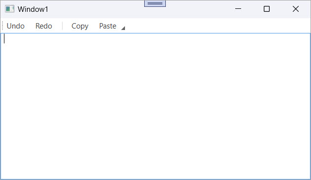

<!-- default badges list -->

[](https://supportcenter.devexpress.com/ticket/details/E1575)
[](https://docs.devexpress.com/GeneralInformation/403183)
[](#does-this-example-address-your-development-requirementsobjectives)
<!-- default badges end -->

# WPF Bars – Visually Group Bar Items with Separators

This example uses the [`BarItemLinkSeparator`](https://docs.devexpress.com/WPF/DevExpress.Xpf.Bars.BarItemLinkSeparator) to visually organize bar items in a [`ToolBarControl`](https://docs.devexpress.com/WPF/DevExpress.Xpf.Bars.ToolBarControl).



Use this technique when you want to:

- Group related commands visually to improve toolbar clarity.
- Separate logical blocks of actions (for example, `Undo`/`Redo` and `Copy`/`Paste`) without introducing new containers.
- Enhance the usability of complex toolbars.

## Implementation details

### Toolbar Definition

Define a `ToolBarControl` inside a [`BarContainerControl`](https://docs.devexpress.com/WPF/DevExpress.Xpf.Bars.BarContainerControl) with five command buttons:

```xaml
<dxb:ToolBarControl Caption="Main Toolbar">
    <dxb:BarButtonItem Content="Undo" Glyph="{dx:DXImage Image=undo16x16.png}" />
    <dxb:BarButtonItem Content="Redo" Glyph="{dx:DXImage Image=redo16x16.png}" />
    <dxb:BarItemLinkSeparator />
    <dxb:BarButtonItem Content="Copy" Glyph="{dx:DXImage Image=copy16x16.png}" />
    <dxb:BarButtonItem Content="Paste" Glyph="{dx:DXImage Image=paste16x16.png}" />
</dxb:ToolBarControl>
```

### Visual Groups

The [`BarItemLinkSeparator`](https://docs.devexpress.com/WPF/DevExpress.Xpf.Bars.BarItemLinkSeparator) element creates a visual break between the `Undo/Redo` group and the `Copy/Paste` group, to help users quickly distinguish between command categories without affecting the layout or behavior.

### Handle Item Click 

Each button handles clicks through a shared event handler:

```csharp
private void itemClick(object sender, DevExpress.Xpf.Bars.ItemClickEventArgs e) {
    MessageBox.Show("Item " + e.Item.Content + " has been clicked.");
}
```

## Files to Review

* [Window1.xaml](./CS/BarItemLinkSeparatorEx/Window1.xaml) (VB: [Window1.xaml](./VB/BarItemLinkSeparatorEx/Window1.xaml))
* [Window1.xaml.cs](./CS/BarItemLinkSeparatorEx/Window1.xaml.cs) (VB: [Window1.xaml.vb](./VB/BarItemLinkSeparatorEx/Window1.xaml.vb))

## Documentation

* [BarItemLinkSeparator](https://docs.devexpress.com/WPF/DevExpress.Xpf.Bars.BarItemLinkSeparator)
* [ToolBarControl](https://docs.devexpress.com/WPF/DevExpress.Xpf.Bars.ToolBarControl)
* [BarContainerControl](https://docs.devexpress.com/WPF/DevExpress.Xpf.Bars.BarContainerControl)
* [Bars Overview](https://docs.devexpress.com/WPF/6194/controls-and-libraries/ribbon-bars-and-menu/bars?p=netframework)

## More Examples

* [WPF Bars – Create a container for BarItem links](https://github.com/DevExpress-Examples/wpf-bars-create-baritem-link-container)
* [MVVM Application with WPF Bars](https://github.com/DevExpress-Examples/mvvm-application-with-wpf-bars)
* [WPF PDF Viewer – Customize the Integrated Bar's Commands](https://github.com/DevExpress-Examples/wpf-pdf-viewer-customize-bar-manager)

<!-- feedback -->
## Does this example address your development requirements/objectives?

[](https://www.devexpress.com/support/examples/survey.xml?utm_source=github&utm_campaign=wpf-bars-visually-separate-bar-items&~~~was_helpful=yes) [](https://www.devexpress.com/support/examples/survey.xml?utm_source=github&utm_campaign=wpf-bars-visually-separate-bar-items&~~~was_helpful=no)

(you will be redirected to DevExpress.com to submit your response)
<!-- feedback end -->
